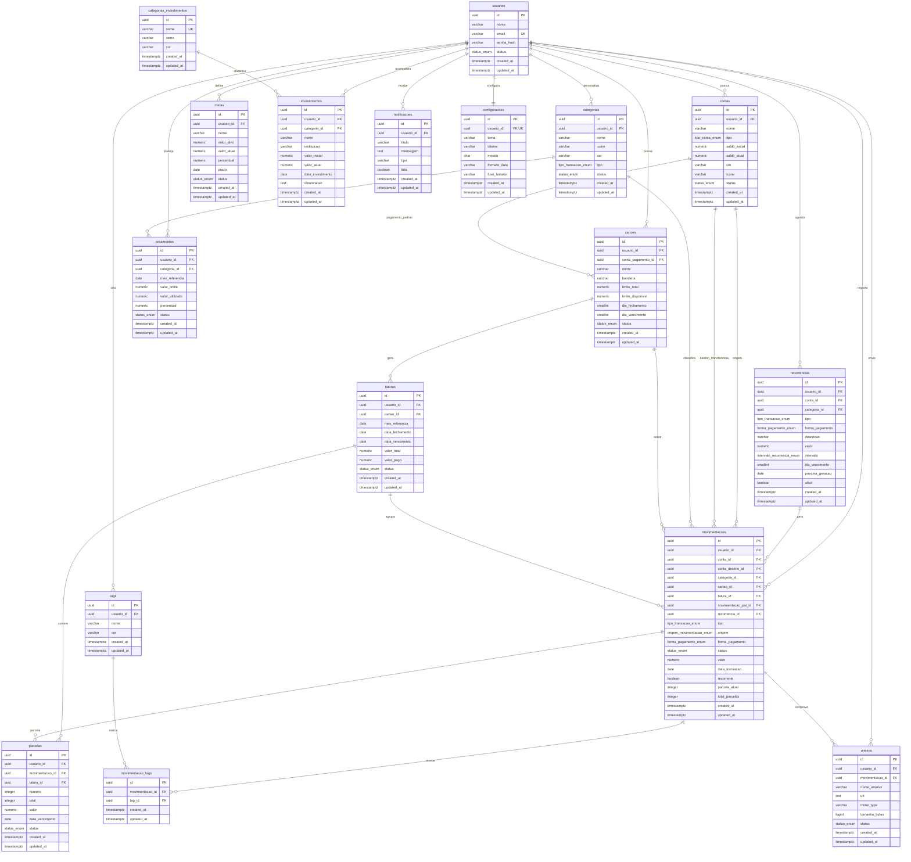

# DER - FinSight

```mermaid
erDiagram
    usuarios ||--o{ contas : possui
    usuarios ||--o{ categorias : personaliza
    usuarios ||--o{ movimentacoes : registra
    usuarios ||--o{ recorrencias : agenda
    recorrencias ||--o{ movimentacoes : gera
    usuarios ||--o{ cartoes : possui
    usuarios ||--o{ metas : define
    usuarios ||--o{ investimentos : acompanha
    usuarios ||--o{ orcamentos : planeja
    usuarios ||--o{ tags : cria
    usuarios ||--o{ anexos : envia
    usuarios ||--o{ notificacoes : recebe
    usuarios ||--|| configuracoes : configura

    contas ||--o{ movimentacoes : origem
    contas ||--o{ movimentacoes : destino_transferencia
    contas ||--o{ cartoes : pagamento_padrao
    categorias ||--o{ movimentacoes : classifica
    categorias ||--o{ orcamentos : limita
    categorias_investimentos ||--o{ investimentos : classifica
    cartoes ||--o{ faturas : gera
    cartoes ||--o{ movimentacoes : cobra
    faturas ||--o{ movimentacoes : agrupa
    faturas ||--o{ parcelas : contem
    movimentacoes ||--o{ parcelas : parcela
    movimentacoes ||--o{ movimentacao_tags : recebe
    tags ||--o{ movimentacao_tags : marca
    movimentacoes ||--o{ anexos : comprova

    usuarios {
        uuid id PK
        varchar nome
        varchar email UK
        varchar senha_hash
        status_enum status
        timestamptz created_at
        timestamptz updated_at
    }

    contas {
        uuid id PK
        uuid usuario_id FK
        varchar nome
        tipo_conta_enum tipo
        numeric saldo_inicial
        numeric saldo_atual
        varchar cor
        varchar icone
        status_enum status
        timestamptz created_at
        timestamptz updated_at
    }

    categorias {
        uuid id PK
        uuid usuario_id FK
        varchar nome
        varchar icone
        varchar cor
        tipo_transacao_enum tipo
        status_enum status
        timestamptz created_at
        timestamptz updated_at
    }

    categorias_investimentos {
        uuid id PK
        varchar nome UK
        varchar icone
        varchar cor
        timestamptz created_at
        timestamptz updated_at
    }

    investimentos {
        uuid id PK
        uuid usuario_id FK
        uuid categoria_id FK
        varchar nome
        varchar instituicao
        numeric valor_inicial
        numeric valor_atual
        date data_investimento
        text observacao
        timestamptz created_at
        timestamptz updated_at
    }

    movimentacoes {
        uuid id PK
        uuid usuario_id FK
        uuid conta_id FK
        uuid conta_destino_id FK
        uuid categoria_id FK
        uuid cartao_id FK
        uuid fatura_id FK
        uuid movimentacao_pai_id FK
        uuid recorrencia_id FK
        tipo_transacao_enum tipo
        origem_movimentacao_enum origem
        forma_pagamento_enum forma_pagamento
        status_enum status
        numeric valor
        date data_transacao
        boolean recorrente
        integer parcela_atual
        integer total_parcelas
        timestamptz created_at
        timestamptz updated_at
    }

    cartoes {
        uuid id PK
        uuid usuario_id FK
        uuid conta_pagamento_id FK
        varchar nome
        varchar bandeira
        numeric limite_total
        numeric limite_disponivel
        smallint dia_fechamento
        smallint dia_vencimento
        status_enum status
        timestamptz created_at
        timestamptz updated_at
    }

    faturas {
        uuid id PK
        uuid usuario_id FK
        uuid cartao_id FK
        date mes_referencia
        date data_fechamento
        date data_vencimento
        numeric valor_total
        numeric valor_pago
        status_enum status
        timestamptz created_at
        timestamptz updated_at
    }

    recorrencias {
        uuid id PK
        uuid usuario_id FK
        uuid conta_id FK
        uuid categoria_id FK
        tipo_transacao_enum tipo
        forma_pagamento_enum forma_pagamento
        varchar descricao
        numeric valor
        intervalo_recorrencia_enum intervalo
        smallint dia_vencimento
        date proxima_geracao
        boolean ativa
        timestamptz created_at
        timestamptz updated_at
    }

    parcelas {
        uuid id PK
        uuid usuario_id FK
        uuid movimentacao_id FK
        uuid fatura_id FK
        integer numero
        integer total
        numeric valor
        date data_vencimento
        status_enum status
        timestamptz created_at
        timestamptz updated_at
    }

    metas {
        uuid id PK
        uuid usuario_id FK
        varchar nome
        numeric valor_alvo
        numeric valor_atual
        numeric percentual
        date prazo
        status_enum status
        timestamptz created_at
        timestamptz updated_at
    }

    orcamentos {
        uuid id PK
        uuid usuario_id FK
        uuid categoria_id FK
        date mes_referencia
        numeric valor_limite
        numeric valor_utilizado
        numeric percentual
        status_enum status
        timestamptz created_at
        timestamptz updated_at
    }

    tags {
        uuid id PK
        uuid usuario_id FK
        varchar nome
        varchar cor
        timestamptz created_at
        timestamptz updated_at
    }

    movimentacao_tags {
        uuid id PK
        uuid movimentacao_id FK
        uuid tag_id FK
        timestamptz created_at
        timestamptz updated_at
    }

    anexos {
        uuid id PK
        uuid usuario_id FK
        uuid movimentacao_id FK
        varchar nome_arquivo
        text url
        varchar mime_type
        bigint tamanho_bytes
        status_enum status
        timestamptz created_at
        timestamptz updated_at
    }

    notificacoes {
        uuid id PK
        uuid usuario_id FK
        varchar titulo
        text mensagem
        varchar tipo
        boolean lida
        timestamptz created_at
        timestamptz updated_at
    }

    configuracoes {
        uuid id PK
        uuid usuario_id FK,UK
        varchar tema
        varchar idioma
        char moeda
        varchar formato_data
        varchar fuso_horario
        timestamptz created_at
        timestamptz updated_at
    }
```
